# ORB-SLAM implementation TODOs
아 막막허다   
아직 코드 파악이 완벽하게 안되었기 때문에(영원히 못할듯), 
할 일을 알고리즘 측면에서 파악된 것들 / 코드 해석하면서 파악된 것들로 나누어 작성하고 
알고리즘 측면 -> 코드 파악은 차차 해나가도록 하겠습니다  
텝스 죽었으면

## 알고리즘 설명
### 전체 구조
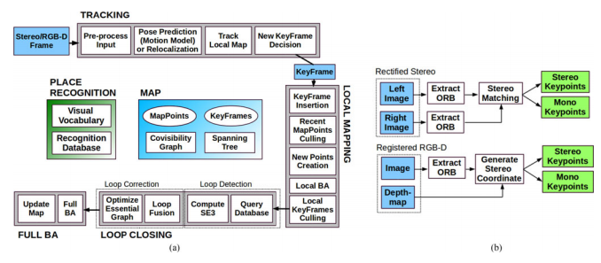  
전체 그래프 구조입니다.  
크게 TRACKING, LOCAL MAPPING, LOOP CLOSING 단계로 나뉘어지고, thread로 나뉘어진 걸로 알고있습니다.  
ORB SLAM system에 대해서 완전히 파악하지 못하셨을것이니(냅두면 저도 까먹음) 우선 ORB-SLAM2의 시스템부터 설명해보겠습니다.  

https://cseweb.ucsd.edu/classes/sp17/cse252C-a/CSE252C_20170503.pdf  
이거 괜찮습니다.

-----------------------

### TRACKING 단계
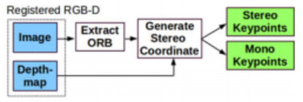  
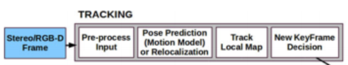  

1. RGB Image와 Depth Image를 받아서 ORB를 추출하고  
   Generate Stereo Coordinate 단계에서 어떻게어떻게 자체적으로 카메라 calibration을 하는거 같습니다.
    * ORB같은 경우엔 keypoint(특징점, 불변점) detection은 FAST를, descriptor(각 불변점들의 특징)는 BRIEF의 변형인 ORB(oriented FAST and Rotated BREIF)를 사용합니다.
    * FAST는 각 픽셀마다 주변 픽셀의 밝기를 구해서, 몇 개 이상이 차이가 난다면 특징점으로 둡니다.
      * 영상 내의 임의의 점 p을 중심으로 radius=3px인 원을 그렸을 때, 원이 지나가는 16개의 픽셀과 p의 Intensity 차이가 주어진 threshold보다 높은 픽셀이 n개 이상 '연속'되면 p를 특징점으로 검출
      * n값에 따라 FAST-n이라고 표현하는데, ORB에서는 FAST-9을 사용하는 것으로 알고 있음
      * Edge가 검출되는 경우가 많은데 Edge는 특징점으로 적합하지 않기 떄문에, [Harris Corner Detector](https://en.wikipedia.org/wiki/Harris_Corner_Detector)를 이용하여 코너만 채택
      * Scale-dependent하기 때문에 특징점 결과가 다르게 나오는 문제를 해결하기 위해 Computer Vision 분야에서 주로 사용되는 [Scale Pyramid 방법](http://darkpgmr.tistory.com/137)을 사용하여 해결
      * FAST는 Corner 여부는 파악하지만 이들의 방향성을 판단할 수 없기 때문에 이를 검출하기 위해 [Intensity Centroid를 사용](https://en.wikipedia.org/wiki/Image_moment)  
    * BRIEF는 특징점 주변의 점 몇개의 밝기를 구해서 그대로 저장하는데, 이게 회전변환에 취약해서 이를 보완한게 ORB.
      * Binary Test: 특징점 KP 주위의 _w_×_w_ 크기의 이미지 패치 _Iw_ 내부에서 임의의 두 픽셀 _pa_, _pb_ 를 골라 Intensity를 비교
      
        :=\left\{\begin{matrix}1:{I}_{w}\left({p}_{a}\right)%3C{I}_{w}\left({p}_{b}\right)\\\\0:{I}_{w}\left({p}_{a}\right)\ge{I}_{w}\left({p}_{b}\right)\end{matrix}\right)
        <!--//img src="https://latex.codecogs.com/svg.latex?\Large&space;\tau \left( KP; { p }_{ a }, { p }_{ b } \right) := \left\{ \begin{matrix} 1: { I }_{ w }\left( { p }_{ a } \right)  < { I }_{ w }\left( { p }_{ b } \right)  \\ 0: { I }_{ w }\left( { p }_{ a } \right)  \ge  { I }_{ w }\left( { p }_{ b } \right)  \end{matrix} \right"//-->
      
      * 두 픽셀을 뽑는 방법 중 KP 주위에서 Gaussian Random Sampling을 이용한 방법이 가장 성능이 좋다고 함. BRIEF 기술자는 n번의 Binary Test 결과를 이진수 벡터로 표현  
      
        :=\sum_{1\le\\i\le0}{2^{i-1}\tau\left(KP;p_{a_{i}},p_{b_{i}}\right)})
        <!--//img src="https://latex.codecogs.com/svg.latex?\Large&space;f_{ n }\left( KP \right) := \sum _{1 \le i \le 0}{ 2^{i-1} \tau \left( KP; p_{a_{i}}, p_{b_{i}} \right)}" title=""//-->
      
      * BRIEF는 이미지 회전에 취약한 단점을 가지고 있기 때문에, Binary Test에 사용되는 픽셀 집합들을 특징점 각도만큼 회전시켜서 모두 같은 곳을 바라보도록 함으로써 BRIEF가 가진 회전 취약성을 보완
      
        )
        <!--//img src="https://latex.codecogs.com/svg.latex?S = \left( \frac { p_{a_{i}}, ... , p_{a_{n}} }{ p_{b_{i}}, ... , p_{b_{n}} }  \right)"//-->
        
        * S는 Binary Test를 위해 선정된 픽셀 집합
        * 특징점 방향을 나타내는 각도가 _θ_ 일때 그에 대응되는 회전변환행렬 _Rθ_ 를 이용해 회전되는 픽셀 집합 _Sθ_ 를 다음과 같이 표현
        
          
          <!--//img src="https://latex.codecogs.com/svg.latex?{ S }_{ \theta } = R_{\theta}S"//-->
           
      * Steered BRIEF로 재탄생
        
        :=f_{n}\left(KP\right)|\left(p_{a_{i}},p_{b_{i}}\right)\in{S}_{\theta})
        <!--//img src="https://latex.codecogs.com/svg.latex?g_{ n }\left( KP,\theta  \right) :=f_{ n }\left( KP \right) |\left( p_{ a_{ i } },p_{ b_{ i } } \right) \in { S }_{ \theta }"//-->
        
        * 단점: 기존 BRIEF와 비교했을 때 입력에 대한 분산 값이 상대적으로 작고, Binary Test간 상관관계가 높아 기술자로서 서로 다른 특징점을 구분하는 성능이 떨어짐
        * ORB에서는 이 단점을 개선해 빠르게 계산이 가능하면서도 안정적이고 높은 성능을 보이는 rBRIEF (아마 rotated-BRIEF)기술자를 도입해 사용
       
    * 자세한 원리를 알고싶으시다면 구글링
      * 구글링 완료
      * http://www.willowgarage.com/sites/default/files/orb_final.pdf
    
2. 지도(3차원 ORB 분포)와 영상(2차원 ORB 분포)를 매칭시켜서 가장 잘 맞는 부분을 카메라 위치로 선정합니다.
    * 즉 localization 작업을 합니다.
    * 영상과 지도를 매칭시키는 작업을 PnP(Perspective-n-Point) 라고 하는데, 3차원<->2차원 좌표간 변환을 하는 수식을 해석해보자면  
    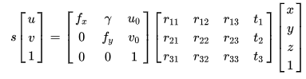  
    scale * 이미지의 2차원 좌표 = intrinsic camera parameters(카메라 성질) * (R | T) * 지도의 3차원 좌표   
    정도가 되겠습니다.  
    여기서 (R | T) matrix(extrinsic camera parameters)가 카메라의 위치 정보를 가지고 있습니다(T: (x, y, z), R: 변환하면 yaw pitch roll)  
    이제 R | T 매트릭스를 열심히열심히 돌려대서 2차원 이미지 -> 3차원 지도로 projection 시켰을 때 오차가 가장 적은 argmin값을 구합니다!  
        * 자유도가 6인데 진짜 저걸 어떻게 argmin으로 구하지 미친건가
    * 저렇게 해서 카메라의 위치를 구하면 오차가 많이 생기기 때문에, Bundle Adjustment라는 과정을 추가로 해서 정확도를 보정합니다.
    
3. Bundle Adjustment
    * 뒤에서도 계속 쓰이는 알고리즘이라 항목을 구분하겠습니다.  
    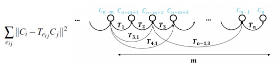
    * 굉장히 간단하게 설명하자면, 카메라 포인트 C1 C2 C3가 있다고 치고, C1과 C2간의 변환행렬(R|T) T1, C2-C3: T2, C1-C3: T3를 알고 있다고 합시다.
        * 카메라 포인트는 현재 프레임과 keyframe으로 추정되고, 각 변환행렬은 keyframe 삽입단계에서 공유된 Mappoint로 계산됩니다.
        * 이해할필요없음 
    * 아무튼 C1->C2->C3를 T1, T2를 통해 계산할 수 있고, C1->C3를 T3를 통해 바로 계산할 수 있습니다.
    * 그렇게 해서 구해진 C3값들 간에는 차이가 생기기 때문에, 이걸 최소화하는 방향으로 카메라 프레임 위치를 조정합니다.
    * 즉 Bundle로 묶인 부분들을 Adjust하기 때문에 Bundle Adjustment(BA)입니다.
        * 다만 TRACKING 단계에서의 BA는 현재 카메라 프레임만 조절하는 것으로 알고있습니다.
    * 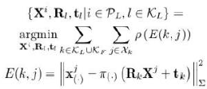 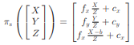 말은 쉽지
    
4. New Keyframe Decision
    * 우선 Keyframe이라는 개념부터 설명합시다.
    * 기본적으로 ORB map은 영상(frame)에서 찍힌 ORB feature들을 다 밀어넣은 것이라고 보시면 됩니다.
    * 물론 1초당 20fps로 찍히는 ORB feature들을 아무 생각 없이 몽땅 맵에 밀어넣으면 당연히 맵과 메모리가 터집니다
    * 그래서 좀 쓸만한 frame만 엄선해서 맵에 밀어넣습니다. 그렇게 엄선된 frame들이 keyframe.
    * 아무튼 현재 frame이 keyframe으로 뽑을만한지 나름의 rule을 통해 판별합니다.
    * 현재 frame이 keyframe이 아니다 싶으면 여기서 끝납니다.
    
-----------------------
    
### LOCAL MAPPING 단계
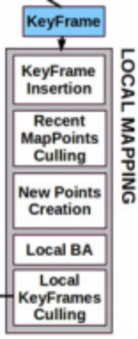 . 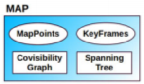  

1. MAP 구성요소
    * MAP은 보시다시피 4개 정도의 구성요소로 이루어져있는데
    1. KeyFrames: 설명했읍니다
    2. MapPoints: KeyFrame에 걸려있는 ORB feature들을 뜻합니다. 당연히 여러 frame에 걸려 있을 수 있으며, 
       그렇게 여러군데에 걸려있는 MapPoint를 이용해서, 각 KeyFrame간의 연결관계인
    3. Covisibility Graph를 생성합니다. MapPoint 15개 이상이 KeyFrame A, B에 걸려있으면 Covisivility Graph에서 A-B가 연결이 됩니다.
    4. MapPoint 갯수 조건을 강화시킨(100개 이상) Essential Graph를 또 생성하고, 거기서 Spanning Tree를 생성합니다.
        * 솔직히 저거 어따쓰는지 아직 모르겠는데 loop closing에 쓰이는거같긴합니다.
        
2. KeyFrame Insertion ~ New Points Creation    
    * 앞에서 구한 frame의 좌표를 토대로, map에다가 frame과 거기 걸려있는 ORB feature(MapPoints)를 우겨넣습니다.  
    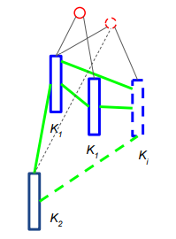  
    Ki: 집어넣을 frame, K1: 인접한 frame, 점선 원: new MapPoints
    * 뭐 그냥 쑥 집어넣었으면 좋겠지만, 여러 절차가 존재합니다. 요약하면
    * 일단 keyframe을 넣고, covisibility graph 업데이트하고,
    * 영 쓸모없는 MapPoint는 일일이 검사해서 버리고,
    * MapPoint 추가할 때 depth라던가 K1의 정보와 비교해서 오차를 좀 수정하며 넣는다고 하는데 자세히는 안나와있습니다.
    
3. Local BA, Local KeyFrames Culling
    * 여기서 끝내지 않고, 앞에서 카메라 frame을 대상으로 한 Bundle Adjustment와 유사하게 MapPoint 기준으로 BA를 진행합니다.
    * 그렇게 keyframe들의 위치가 좀 바뀌면, Local KeyFrames Culling을 통해 쓸모없는걸 또 쳐냅니다.
    
좀 더 자세한 과정을 알고싶으면  
https://cseweb.ucsd.edu/classes/sp17/cse252C-a/CSE252C_20170503.pdf 나  
https://ieeexplore.ieee.org/stamp/stamp.jsp?arnumber=7946260&tag=1 을 참조하시되  
솔직히 둘 다 별로 이해가 될만큼 자세한 정보는 없고 관심있으시면 코드를 뜯으셔야 할겁니다.

-----------------------
    
### LOOP CLOSING 단계
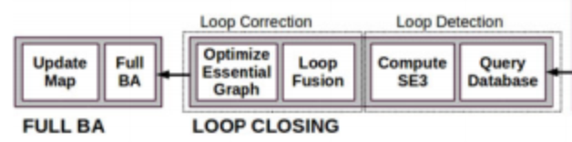
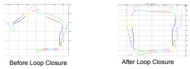

1. Loop closing 단계에선, 이전에 갔던 keyframe A와 현재 keyframe B가 비슷한 위치에 있다고 판단되면, 
   A와 B를 연결시키면서 Loop을 생성하고, 그 안에 엮인 keyframe들의 위치를 재조정하는 단계입니다.
    * 각 단계는 모두 rule based한 방법으로 판단하는거 같습니다. 후술.
   
2. Loop Detection 단계는 아래와 같습니다.   
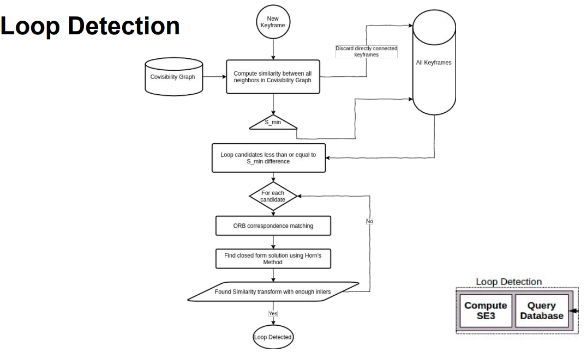
    * 정리하자면, Covisibility Graph에 연결되있지 않으면서 일정 거리 이상으로 떨어진 모든 frame들을 후보로 두고,
    * 모든 후보에 대해서, 일단 끼워 맞춰 봅니다.
        - ORB correspondence matching으로 가장 그럴듯한 공통 지점을 구하고
        - Horn's Method(http://graphics.stanford.edu/~smr/ICP/comparison/horn-hilden-orientation-josa88.pdf) 라는 것을 이용해서 loop을 일단 만들어 놓고
        - 충분히 그럴듯 해 보이면 맞는 Loop으로 간주합니다.

3. Loop Correction 단계는 아래와 같습니다.  
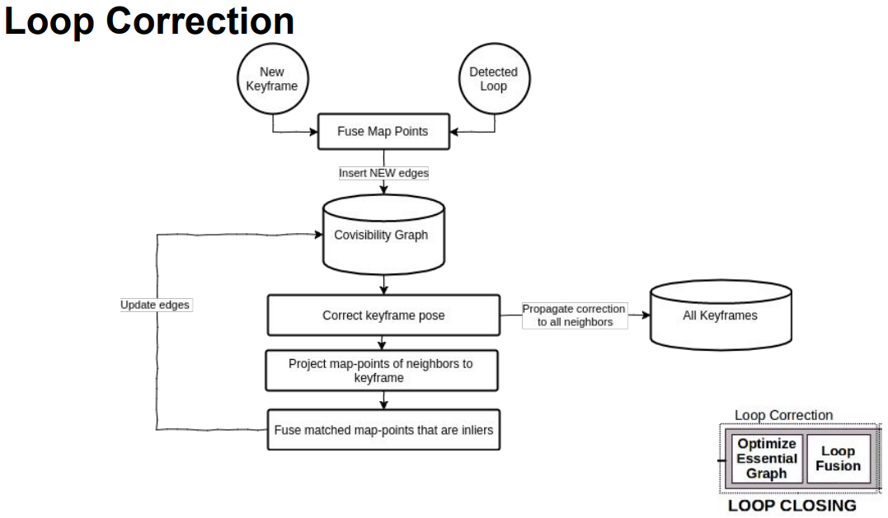
    * 일단 새로 연결되는 두 frame간 공통 Map Point를 구하고 graph에 edge를 삽입한 뒤
    * Covisibility Graph에 연결된 keyframe들에 대해서 pose와 map-point를 다시 구하고
    * Loop에는 안들어가지만 거기에 연결된 keyframe들에 대해서도 위치를 보정합니다.
    * 사실 말만 길고 당연한 소리인데, 어떻게 구현이 되어있는지는 역시 코드를 참조해야될같습니다
        - 하
    
4. Loop Correction이 이루어졌다면, 이제 모든 keyframe에 대해서 Bundle Adjustment를 진행합니다(full BA).

</알고리즘 설명>

--------------------------

## 수정이 필요한 부분

### GOAL
__아래의 내용들은 모두 discussion 을 거치고 확정을 해야 할 할 부분입니다__
* 우리의 목표는 `augmentation of current visual slam (orbslam2) with object recognition`.
* augmentation이라는 말의 범위가 넓긴 하지만, 현재로선 YOLO의 labeling 결과를 map-point에 저장해서 써먹겠다는 뜻으로 알고있습니다.
* 불변점을 감지하는 FAST 알고리즘 자체는 건들일 부분이 딱히 없으며, descriptor인 ORB(char[32])에 추가로 라벨링 결과를 append하여 각 특징점들에 라벨을 붙입니다.   
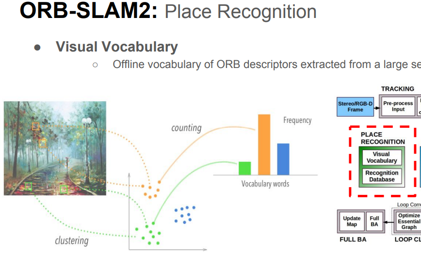
* 또한, 기존 ORB-SLAM에서 yolo와 비슷하게 물체를 감지(?)하는 부분이 있는데 (Visual Vocabulary), 이 부분을 YOLO로 대체해 보는 것을 목표로 합니다.
    * 기존 Visual Vocabulary는 물체를 잔뜩 찍어 놓고, ORB를 감지해본 뒤, 물체마다 가지는 고유한 feature 분포를 싸그리 저장해놓고(Bag of Words, BoW)
    * 새로운 frame이 들어오면 여기에다가 matching시켜버리는 유사 object detection입니다.
    * PLACE RECOGNITION 부분에 들어간 것으로 보아 tracking lost 상황에서 쓰이는 것으로 추정중.
    

### 진행이 된 부분
https://github.com/team-aupair/ORB_SLAM2

* ORB 실행 function에 YOLO output을 1byte(class index) matrix 형태로 추가함. (class_image라고 부릅시다)
* char[32] 형태의 descriptor 초기화 부분을 char[33]으로 변경, descriptor 계산 코드에다가 class index를 삽입
    - keypoint의 좌표 x,y에 해당되는 class_image[x, y]를 descriptor[32]에 할당.
* 각 descriptor간의 유사도를 구하는 `DescriptorDistance` 함수에 class index값에 대한 계산 추가
    - descriptor A, B의 class index가 모두 0(no class)이 아니라면
    - 같으면 계산된 distance를 4로 나눔
    - 다르면 계산된 distance에 2를 곱합.
* 생성된 map-point에 변경된 descriptor가 적용되는지 확인
    - 생성된 지도를 ROS쪽 코드로 불러와서 descriptor를 추출
    - 추출된 descriptor의 [32]번째 index를 불러와서 값이 할당되었는지를 Rviz로 표시
    - 알록달록

### 진행해야 할 부분

#### Tracking 단계
1. ORB 추출
    * 유사 mask-rcnn처럼 depth image로 bounding line 따기. (현재는 그냥 bounding box로 막 치고 있음)
    * Keypoint detection에 class_image 사용이 가능한가?
2. camera pose prediction
    * `R | T 매트릭스를 열심히열심히 돌려대서 2차원 이미지 -> 3차원 지도로 projection 시켰을 때 오차가 가장 적은 argmin값을 구합니다!`
    * 이 부분에서 `오차`에 descriptor가 관여하게 되는데, 단순히 descriptor distance만으로 해결이 되는지 혹은 다른짓을 해야하는지

3. Bundle Adjustment
    * 수식을 보시면 아시겠지만, descriptor가 관여하는 부분은 없고 각 frame간의 변환관계인 T값에 의존합니다.
        - T는 이후 Local Mapping 과정에서 구해지지 않을까 싶습니다.
    * 다만 좀 의심되는 부분이 rho(robust Huber cost function)인데 뭐하는 놈인지 한번 알아봐야될듯
     
#### Local Mapping 단계
1. KeyFrame Insertion ~ New Points Creation
    * camera pose prediction과 마찬가지로, 단순히 descriptor distance만으로 해결이 되는지 혹은 다른짓을 해야하는지

2. Local BA, Local KeyFrames Culling
    * BA는 기본적인 구조는 Tracking, Local Mapping, Global Mapping 세 부분 모두 동일합니다.
    * culling은 크게 신경안써도
    
#### LOOP CLOSING 단계
1. Loop detection 단계에서는, 기본적인 state는 같게 유지하되 역시 'For each candidate' 부분 이후부터 살펴봐야 합니다.
2. Loop correction 단계 역시 state는 유지하고 'Covisibility graph' 이후부터 살펴봐야....

##### Q: 님이 살펴보면 되잖어요
##### A: 보다 토나와서 포기했습니다 혼자서는 절대 못함.

--------------------------

## 코드 분석

기본적으로 살펴봐야 하는 부분은  
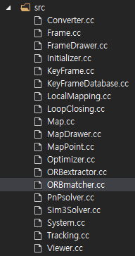  
src 폴더 내부지만 (필요하다면 include 내부의 헤더파일도)

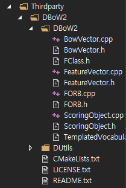  
Thirdparty 내부의 DBoW2 쪽 코드도 봐야하는것으로 밝혀져... 충격...

> ### Converter.cc
> quaternion - RPY - rotation matrix 나 자료형같이 단순 변환하는 코드입니다. 위험도 낮음.
> 
> ### Frame.cc
> (KeyFrame이 아니라) 현재 카메라 화면을 담당하는 코드입니다. ORB 뽑는거같은건 여기서 하겠죠. 위험도 보통
> 
> ### FrameDrawer.cc
> UI쪽 코드입니다. 위험도 낮음.
> 
> ### Initializer.cc 
> 초기화 담당 코드인데 슬슬 뭐래는지 모르겠는 것들이 막 등장하면서 읽기 거지같아집니다.  
> 하지만 discriptor쪽에서 바꿔야 하는 부분이 있을 수 있고, triangulate같은 계산쪽 코드도 보이기 때문에 읽어봐야합니다. 위험도 높음.
> 
> ### KeyFrame.cc
> Map의 KeyFrame들을 담당하는 코드입니다. 쭉 읽어봐야 함. 위험도 높음.
> 
> ### KeyFrameDataBase.cc
> Map의 KeyFrame들을 담당하는 코드입니다(2). ORBVocabulary(BoW)같은 부분이 보이기 때문에 역시 쭉 읽어봐야 합니다. 위험도 높음.
> 
> ### LocalMapping.cc
> Local Mapping 단계 쪽 코드들 묶음입니다. 위험도 중간.
> 
> ### LoopClosing.cc
> LoopClosing 단계 관련 코드이고, BoW 관련 코드도 있고 하여간 쭉 봐야합니다. 위험도 높음.
> 
> ### Map.cc
> 구현 관련 코드가 아니라 Class쪽 코드라 별거 없습니다. 위험도 낮음.
> 
> ### MapDrawer.cc 
> UI쪽 코드입니다. 위험도 낮음.
> 
> ### MapPoint.cc
> Map의 MapPoint들을 담당하는 코드입니다. 쭉 읽어봐야 함. 위험도 중간.
> 
> ### Optimizer.cc
> `BundleAdjustment`, `PoseOptimization` 등등 딱 봐도 봐야할 것 같은 이름들이 다수 포진되어 있으며 해석하기도 매우 거지같습니다. 위험도 매우 높음.
> 
> ### ORBextractor.cc
> 제가 이미 Descriptor 관련된 코드들은 모두 고쳤습니다.  
> 다만 keypoint 추출 방식을 바꿀거라던가 기타등등 바뀔 수 있는 여지는 남아있음. 위험도 낮음
> 
> ### ORBmatcher.cc
> 역시 제가 `DescriptorDistance` 쪽 코드는 고친 상태입니다만, 그 외 코드는 보지 않았고 계산 관련 코드도 많아서 다시 봐야합니다. 위험도 높음.
> 
> ### PnPsolver.cc
> 위에서 언급한, 2차원 영상-3차원 지도 간 매칭을 담당하는 코드입니다. 위험도 높음.
> 
> ### Sim3Solver.cc
> 저는 아직 Sim3이 뭐하는놈인지 모르겠습니다. 역시 계산관련 코드. 뭐하는건지 모르겠어서 미지의 세계. 위험도 높음
> 
> ### System.cc
> 어떻게 보면 main에 해당되는 코드입니다. high level이기 때문에 실제로 바뀔 부분은 없을듯. 위험도 낮음.
> 
> ### Tracking.cc
> Tracking 쪽 코드를 high level에서 관리하는 코드입니다. 다만 Tracking Lost 상태에서 어떻게 동작하는지 등 볼 부분은 있음. 위험도 보통
> 
> ### Viewer.cc
> 역시 UI쪽 코드. 이걸 진작에 봤으면 거지같은 Follow Camera랑 Localization mode를 default로 끌 수 있었을건데 아쉽습니다. 위험도 낮음.
> 
> ### BowVector.cpp
> 별거 없습니다. 위험도 낮음.
> 
> ### FeatureVector.cpp
> 별거 없습니다. 위험도 낮음.
> 
> ### FORB.cpp
> `ORBmatcher.cc`에서 변경한 `DescriptorDistance`와 비슷한 부분을 DBow쪽에서 정의한 코드라서 바꿔줘야 합니다. 특별히 볼 건 없고 바꿔주기만 하면 될듯. 위험도 중간.
> 
> ### ScoringObject.cpp
> 뭔가 열심히 점수를 매기고 있습니다. 위험도 높음.  
> 
> ### ThirdParty/g2o 쪽 코드들
> `Optimizer.cc`에서 g2o를 열심히 import해오고 있습니다. 필요에 따라 봐야할 수도 있지만 제발 그럴 일이 없기를

아무튼 이런걸 쭉 봐야할거같습니다. 저 혼자 읽으라고 하시면 우울증걸릴거같습니다 살려주세요.

-------------------

## 추가

맨 처음에 ORB-SLAM2 논문만 읽어서, 얘내들이 논문을 되게 Abstract하게 쓰는 스타일이구나 했었는데  
생각해보니 ORB-SLAM 논문이 먼저 나왔을거고 ORB-SLAM2는 거기다가 확장만 한거라 내용이 ORB-SLAM 논문에 더 많겠구나 싶어서 들어가봤더니   
역시나 내용 빠진 부분들이 다 여기에 들어가 있었습니다... Sim3라던가 essential graph라던가...  
읽어보고 수정하겠습니다.
